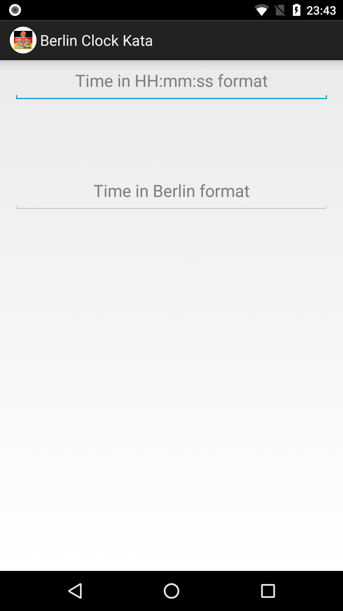
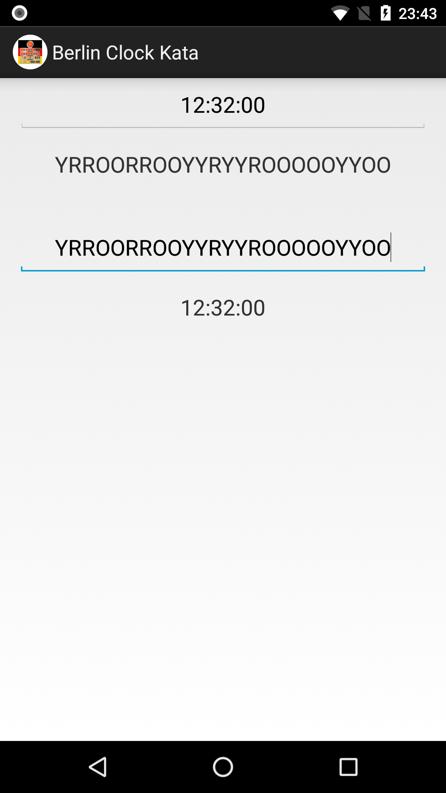

# Berlin Clock Kata

The Berlin Clock (Mengenlehreclock or Berlin Uhr) is a clock that tells the time using a series of illuminated coloured blocks.

## Installing

You can clone/download this repository and open with Android Studio.

You can run app or tests from selecting configurations.

## Usage

When the application starts, it looks like below.

When you type a valid digital time (in HH:mm:ss format) to first EditBox,  
the Berlin time equivalent will be shown below this EditBox.

When you type a valid Berlin time to second EditBox,  
the digital time equivalent will be shown below this EditBox.

UI looks like below after inputs are provided.

You can copy values from output TextViews just clicking on them.
